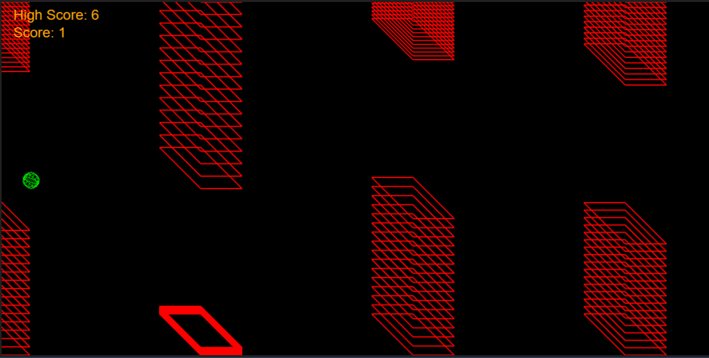

# FlabbyTRON (but can it run FlabbyTRON?)
Flappy bird homage created with early alpha version of my Codie --> Pseudo Code --> Code Systematic Assisted Code Generation GPT. 

Better 'en Crysis. Have fun! (3-4 hours of work, revisions, debugging etc.)

Play FlabbyTRON!  
[FlabbyTRON ~ everybody says it's better 'en Crysis](https://pgleamy.github.io/FlabbyTRON/)
* INSTRUCTIONS: downarrow

